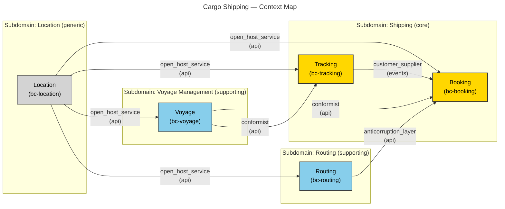
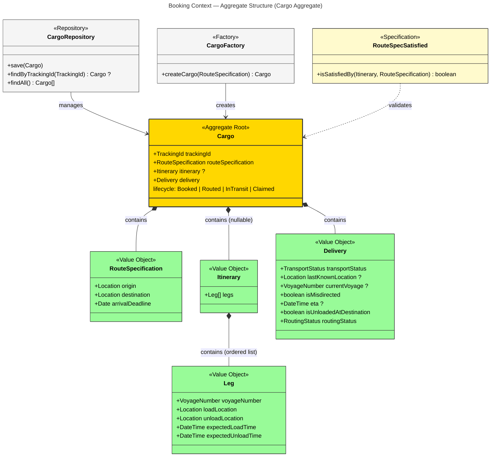
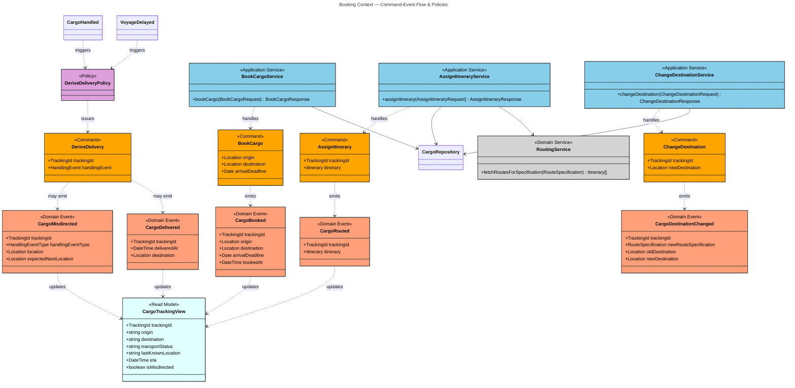
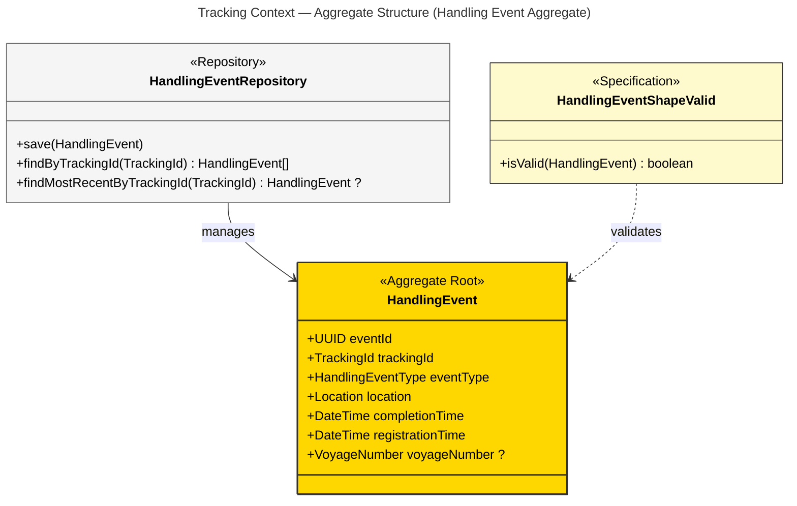
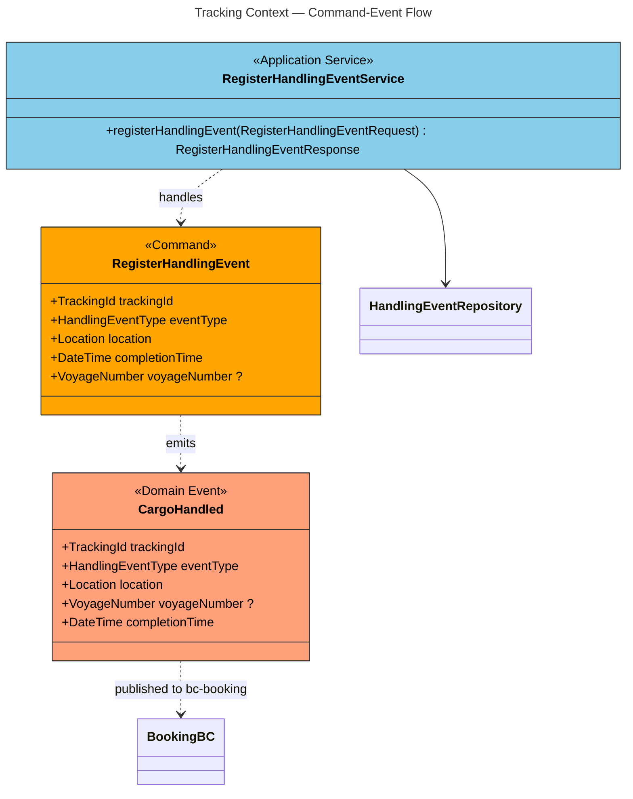
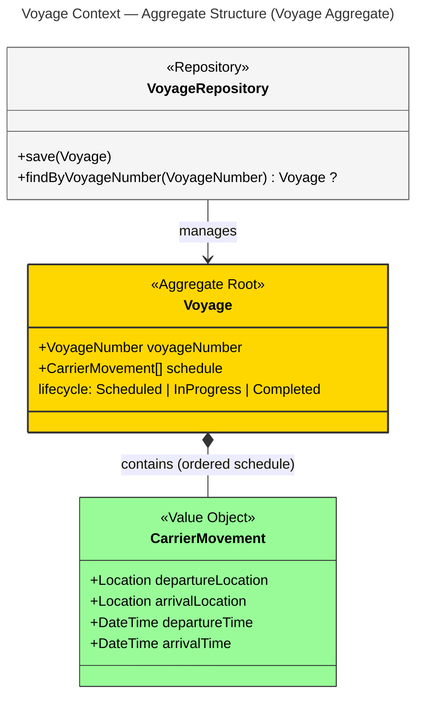
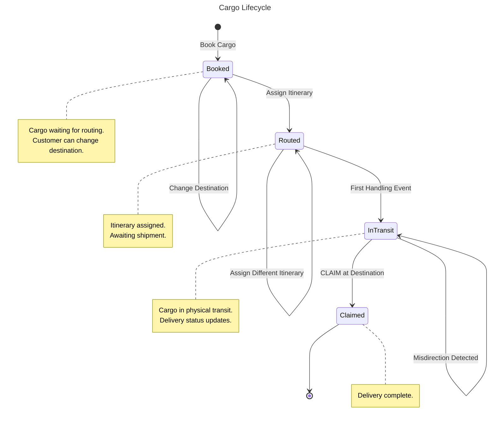
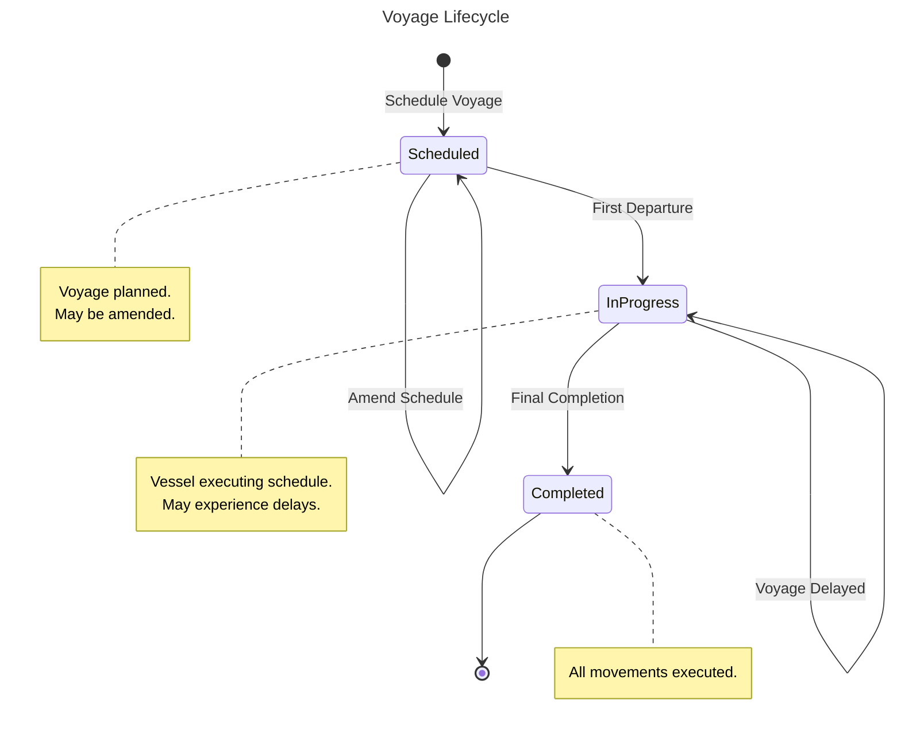

# Cargo Shipping Domain Model — Mermaid Diagrams

## Summary

This document contains a comprehensive set of Mermaid diagrams generated from the **Cargo Shipping DMML** (Domain Model Markup Language) specification.

**Total Diagrams**: 10 (1 context map + 2 aggregate structure diagrams + 2 command-event flow diagrams + 4 lifecycle state diagrams)

**Coverage Summary**:
- Bounded Contexts: 5 (4 implementable, 1 external)
- Aggregates: 4
- Entities: 5
- Value Objects: 6
- Commands: 6
- Domain Events: 8
- Policies: 1
- Specifications: 2
- Domain Services: 2
- Application Services: 4
- Repositories: 4
- Factories: 1
- Read Models: 1
- Entities with Lifecycles: 2

---

## Legend

```mermaid
---
title: DDD Concept Legend
---
classDiagram
    class AggregateRoot {
        <<Aggregate Root>>
    }
    class Entity {
        <<Entity>>
    }
    class ValueObject {
        <<Value Object>>
    }
    class Command {
        <<Command>>
    }
    class DomainEvent {
        <<Domain Event>>
    }
    class Policy {
        <<Policy>>
    }
    class ReadModel {
        <<Read Model>>
    }
    class DomainService {
        <<Domain Service>>
    }
    class Repository {
        <<Repository>>
    }
    class Factory {
        <<Factory>>
    }
    class Specification {
        <<Specification>>
    }

    cssClass "AggregateRoot" aggregateRoot
    cssClass "Entity" entity
    cssClass "ValueObject" valueObject
    cssClass "Command" command
    cssClass "DomainEvent" domainEvent
    cssClass "Policy" policy
    cssClass "ReadModel" readModel
    cssClass "DomainService" domainService
    cssClass "Repository" repository
    cssClass "Factory" factory
    cssClass "Specification" specification

    classDef aggregateRoot fill:#FFD700,stroke:#333,stroke-width:2px,color:#000
    classDef entity fill:#87CEEB,stroke:#333,stroke-width:1px,color:#000
    classDef valueObject fill:#98FB98,stroke:#333,stroke-width:1px,color:#000
    classDef command fill:#FFA500,stroke:#333,stroke-width:1px,color:#000
    classDef domainEvent fill:#FFA07A,stroke:#333,stroke-width:1px,color:#000
    classDef policy fill:#DDA0DD,stroke:#333,stroke-width:1px,color:#000
    classDef readModel fill:#E0FFFF,stroke:#333,stroke-width:1px,color:#000
    classDef domainService fill:#D3D3D3,stroke:#333,stroke-width:1px,color:#000
    classDef repository fill:#F5F5F5,stroke:#666,stroke-width:1px,color:#000
    classDef factory fill:#F5F5F5,stroke:#666,stroke-width:1px,color:#000
    classDef specification fill:#FFFACD,stroke:#333,stroke-width:1px,color:#000
```

---

# Part 1 — Strategic Design

## Context Map

---

# Part 2 — Tactical Design

## Booking Context — Aggregate Structure

## Booking Context — Command-Event Flow

## Tracking Context — Aggregate Structure

## Tracking Context — Command-Event Flow

## Voyage Context — Aggregate Structure

## Cargo Lifecycle

## Voyage Lifecycle

---

**Generated from DMML v0.1.0 — Cargo Shipping Reference Model**

---

## Appendix: Element Coverage

This appendix ensures all DMML elements are referenced in the diagrams.

### Context Map Relationships (Strategic Design)

The following context map relationships are shown in the Context Map diagram:

- **Booking ← Tracking** (customer_supplier / events)
- **Booking → Routing** (anticorruption_layer / api)
- **Booking ← Voyage** (conformist / api)
- **Tracking ← Voyage** (conformist / api)
- **All Contexts ← Location** (open_host_service / api)

### Booking Context — Missing Elements

- **Derive Delivery on Handling Event** (Policy): Reactive policy triggered by CargoHandled or VoyageDelayed events, issues DeriveDelivery command. Shown in Booking Command-Event Flow diagram.
- **Route Specification Satisfied** (Specification): Validates that an itinerary satisfies a route specification. Shown in Booking Aggregate Structure diagram.

### Routing Context

- **Route Finder Service** (Domain Service): Provides `findOptimalRoutes(origin, destination, deadline) -> Itinerary[]`. Core algorithmic service of Routing context, accessed through RoutingService ACL in Booking context.

### Voyage Context

- **Schedule Voyage Service** (Application Service): Orchestrates voyage scheduling. Handles ScheduleVoyage command. Not diagrammed (Voyage context is supporting/tactical).

### Location Context

- **LocationRepository** (Repository): Provides `findByUnlocode()` and `findAll()` operations for the Location aggregate. Not diagrammed (Location is generic reference data).

---

