# Joe's Pizza Place — Domain Model Diagrams

Generated from DMML v0.1.0 — 2026-03-28

**Model Status:** Proposed
**Authors:** Joseph Yoder (domain exercise), Marden Neubert (DMML adaptation)
**ESML Source:** joes-pizza-es-board-reference.esml.yaml

---

## Legend and Coverage Summary

### Element Type Reference

```mermaid
---
title: DDD Element Type Legend
---
classDiagram
    class AggregateRootExample {
        <<Aggregate Root>>
        +id UUID
        +status State
    }
    class EntityExample {
        <<Entity>>
        +id UUID
        +value string
    }
    class ValueObjectExample {
        <<Value Object>>
        +field1 Type
        +field2 Type
    }
    class CommandExample {
        <<Command>>
        +field Type
    }
    class DomainEventExample {
        <<Domain Event>>
        +field Type
        +timestamp DateTime
    }
    class PolicyExample {
        <<Policy>>
        +rule string
    }
    class ReadModelExample {
        <<Read Model>>
        +field Type
    }
    class DomainServiceExample {
        <<Domain Service>>
        +method() Result
    }
    class RepositoryExample {
        <<Repository>>
        +save() void
    }
    class FactoryExample {
        <<Factory>>
        +create() Aggregate
    }

    cssClass "AggregateRootExample" aggregateRoot
    cssClass "EntityExample" entity
    cssClass "ValueObjectExample" valueObject
    cssClass "CommandExample" command
    cssClass "DomainEventExample" domainEvent
    cssClass "PolicyExample" policy
    cssClass "ReadModelExample" readModel
    cssClass "DomainServiceExample" domainService
    cssClass "RepositoryExample" repository
    cssClass "FactoryExample" factory

    classDef aggregateRoot fill:#FFD700,stroke:#333,stroke-width:2px,color:#000
    classDef entity fill:#87CEEB,stroke:#333,stroke-width:1px,color:#000
    classDef valueObject fill:#98FB98,stroke:#333,stroke-width:1px,color:#000
    classDef command fill:#FFA500,stroke:#333,stroke-width:1px,color:#000
    classDef domainEvent fill:#FFA07A,stroke:#333,stroke-width:1px,color:#000
    classDef policy fill:#DDA0DD,stroke:#333,stroke-width:1px,color:#000
    classDef readModel fill:#E0FFFF,stroke:#333,stroke-width:1px,color:#000
    classDef domainService fill:#D3D3D3,stroke:#333,stroke-width:1px,color:#000
    classDef repository fill:#F5F5F5,stroke:#666,stroke-width:1px,color:#000
    classDef factory fill:#F5F5F5,stroke:#666,stroke-width:1px,color:#000
```

### Coverage Summary

| Aspect | Count | Status |
|--------|-------|--------|
| **Subdomains** | 4 | All diagrammed (1 core, 1 supporting, 1 generic, partial external) |
| **Bounded Contexts** | 4 | All diagrammed (3 implementable, 1 external) |
| **Aggregates** | 3 | All diagrammed (Order, Customer, KitchenOrder, Delivery) |
| **Entities** | 5 | All diagrammed (Order, Customer, KitchenOrder, PizzaPreparation, Delivery) |
| **Value Objects** | 3 | All diagrammed (Money, DeliveryAddress, OrderItemSummary) |
| **Commands** | 10 | All diagrammed across command-event flow diagrams |
| **Domain Events** | 13 | All diagrammed across command-event flow diagrams |
| **Policies** | 3 | All diagrammed across command-event flow diagrams |
| **Repositories** | 3 | All diagrammed in aggregate structure diagrams |
| **Application Services** | 3 | All diagrammed in command-event flow diagrams |
| **Lifecycles** | 3 | 3 state diagrams generated (Order, KitchenOrder, Delivery) |
| **Pivotal Events** | 3 | Order Placed, Order Prepared & Packed, Order Delivered |
| **Total Diagrams** | 10 | 1 context map + 3 aggregate structure + 3 command-event + 3 lifecycle |

**Information Loss Mitigation:**
- Ubiquitous language terms encoded as comments in each bounded context's diagram block
- Element status (draft/proposed) encoded as `%%` comments on each element
- Command preconditions shown in `note` blocks
- Invariants shown in `note` blocks
- Integration pattern details (ACL, callback URLs) preserved in comments
- Domain knowledge from transcripts (e.g., brick oven, PIX, WhatsApp) preserved in comments

---

# Part 1 — Strategic Design

## Context Map: Order-to-Delivery Integration

The Joe's Pizza domain is organized around three core subdomains (Ordering, Kitchen Operations, Delivery) plus an external Payments domain. The flow is linear: Order Management → Kitchen → Delivery, with each transition marked by a pivotal event. The Payment Gateway is consulted during ordering but doesn't participate in the downstream flow.

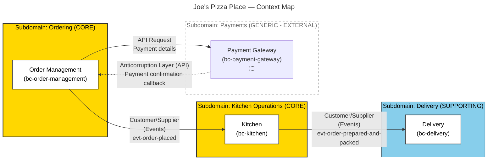

**Ubiquitous Language & Strategic Notes:**

```
%% Core Domain: Ordering
%% - Customer-facing entry point for online pizza orders
%% - Covers menu selection, delivery info collection, payment processing
%% - Key concept: Online-only storefront — the ordering UX is the competitive differentiator

%% Core Domain: Kitchen Operations
%% - Where Joe's competitive advantage lives — handmade brick oven pizza
%% - Detailed event flow reflects deep domain knowledge (prep → bake → box → pack)
%% - Kitchen has a restricted, implementation-focused view: order items only, not customer info or price

%% Supporting Domain: Delivery
%% - Necessary but not differentiating — could be outsourced to iFood/Rappi
%% - Driver organization by neighborhood zones (e.g., Pinheiros)
%% - Informal communication patterns (WhatsApp driver notifications)

%% Integration Topology:
%% - Linear: Order Management (entry) → Kitchen (production) → Delivery (last mile)
%% - All internal integrations are event-based (asynchronous)
%% - Payment Gateway is API-based with ACL to avoid PCI compliance leakage

%% Pivotal Events (phase boundaries):
%% 1. Order Placed — marks end of ordering, triggers kitchen notification
%% 2. Order Prepared & Packed — marks end of kitchen work, triggers delivery dispatch
%% 3. Order Delivered — marks end of delivery workflow

%% Context Map Relationship Notes:
%% rel-orders-kitchen: Kitchen's needs (item list, delivery instructions for packing)
%%   influence Order Placed event payload — customer_supplier pattern
%% rel-kitchen-delivery: Delivery's needs (customer contact, address, instructions)
%%   influence Order Prepared & Packed payload — customer_supplier pattern
%% rel-orders-payment: Payment Gateway is external; ACL translates between payment
%%   provider's model (tokens, processor codes) and our ordering model
```

---

# Part 2 — Tactical Design

## Aggregate Structure: Order Management Bounded Context

The Order Management context owns two aggregates: Customer and Order. Customer captures contact and delivery information; Order is the central entity orchestrating the ordering flow from creation through pizza selection, delivery info, payment, and placement.

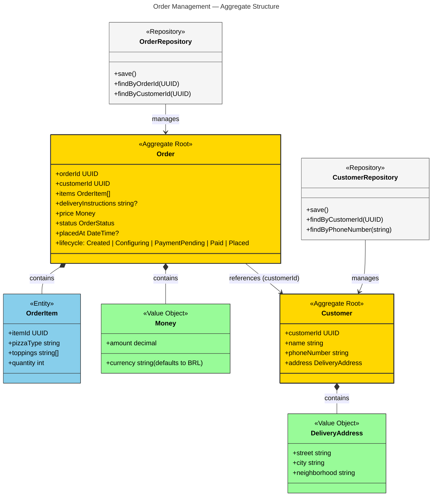

**Invariants and Notes:**

```
%% Invariants (Order aggregate):
%% • Order must have at least one OrderItem
%% • Order must have customer information before placement
%% • Payment must be completed before order can be placed
%% • Price must be positive
%% • Delivery instructions are optional but delivery address is required

%% Invariants (Customer aggregate):
%% • Customer must have a name
%% • Customer must have a phone number or address for delivery

%% Status values for Order lifecycle:
%% Created -> initial state on new order request
%% Configuring -> pizza selection and delivery info entry (concurrent)
%% PaymentPending -> awaiting payment confirmation
%% Paid -> payment completed, ready for placement
%% Placed -> order placed and emitted, handoff to Kitchen

%% Ubiquitous Language (Order Management):
%% - Order: Customer's request for one or more pizzas; contains item selections,
%%   delivery info, payment status. Not "placed" until payment completed.
%% - Customer: Person placing online order; identified by name, phone, address
%% - Order Item: Single line in order specifying pizza with type, toppings, quantity
%% - Pizza Type: Variety of pizza (pepperoni, cheese, etc.)
%% - Delivery Instructions: Special instructions for delivery person (e.g., "leave porch")
%% - Payment: Financial transaction processed by external Payment System;
%%   supports credit card and PIX; must complete before order placement

%% Design Notes:
%% - Customer kept as separate aggregate despite being related to Order
%%   because delivery context also needs customer info independently
%% - Address structure includes neighborhood for driver zone assignment
%%   in São Paulo
%% - Price as Money value object supports currency flexibility (BRL primary)
%% - Payment details (card number, PIX key) NOT stored locally — sent directly
%%   to Payment System via ACL
```

---

## Command-Event Flow: Order Management Bounded Context

The Order Management context coordinates order placement through a sequence of commands that emit domain events. The flow is: request → configure (pizza + delivery in any order) → payment → placement. The pivotal Order Placed event triggers downstream processing in Kitchen.

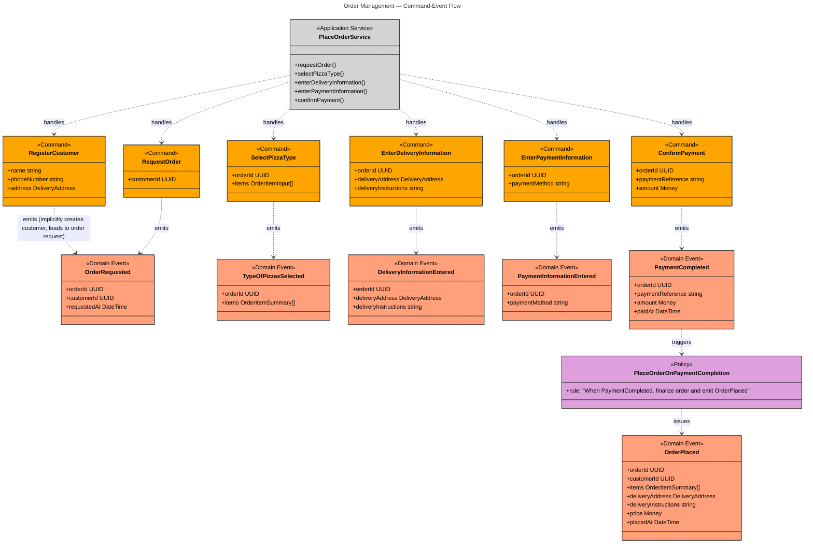

**Command Preconditions and Policy Logic:**

```
%% Command: Register Customer
%% Status: draft (inferred from aggregate structure)
%% Preconditions: None (first step in ordering flow)
%% Maps to: Implicit part of ESML customer creation in cmd-enter-delivery-information (seq 2)
%% This command captures customer information: name, phone, address
%% Joe: "We need the customer's name and delivery address and phone number."
%% Emits: OrderRequested (implicitly creates customer, enables order request)
%% Part of the Place Order Service flow but not explicitly on ESML board

%% Command: Request Order
%% Status: proposed
%% Preconditions: Customer must exist
%% Maps to ESML cmd-request-order (seq 1)
%% Initiated by act-customer-left (customer starting checkout)

%% Command: Select Pizza Type
%% Status: proposed
%% Preconditions: Order must be in Created or Configuring state
%% Concurrent with delivery info entry — "they can happen in either order"
%% Maps to ESML cmd-select-pizza-type (seq 2)

%% Command: Enter Delivery Information
%% Status: proposed
%% Preconditions: Order must be in Created or Configuring state
%% Concurrent with pizza selection
%% Maps to ESML cmd-enter-delivery-information (seq 2)
%% Joe: "We need the customer's name and delivery address and phone number."

%% Command: Enter Payment Information
%% Status: proposed
%% Preconditions:
%%   - Order must be in Configuring state
%%   - Pizza selection and delivery info must be complete
%% Maps to ESML cmd-enter-payment-information (seq 3)
%% Actual payment details forwarded to Payment System via ACL

%% Command: Confirm Payment
%% Status: draft (inferred from integration pattern)
%% Preconditions:
%%   - Order must be in PaymentPending state
%%   - Payment reference must be valid
%% Maps implicit callback from external Payment System (seq 4)
%% Joe: "we redirect the user to the system... the user comes back
%%       with the payment approved or denied."

%% Policy: Place Order on Payment Completion
%% Status: draft (inferred from transcript)
%% Trigger: PaymentCompleted event
%% Rule: When payment is completed, automatically place the order and emit OrderPlaced
%% Joe stated: "if a payment is completed, then the order is placed"
%% No explicit policy sticky on ESML board — inferred from transcript

%% Event: Order Placed (PIVOTAL)
%% Status: proposed
%% This is the first pivotal event on the board
%% Everything downstream depends on it
%% Marks boundary between Orders and Kitchen phases
%% Payload includes all information needed by Kitchen (items) and Delivery
%% Consumed by: bc-kitchen
```

---

## Aggregate Structure: Kitchen Bounded Context

The Kitchen context owns a single aggregate: KitchenOrder. This represents the kitchen's restricted view of an order—just the items to prepare, no customer info or price. Individual pizzas are tracked through a detailed preparation pipeline (Queued → Prepping → Prepped → InOven → Baked → Boxed).

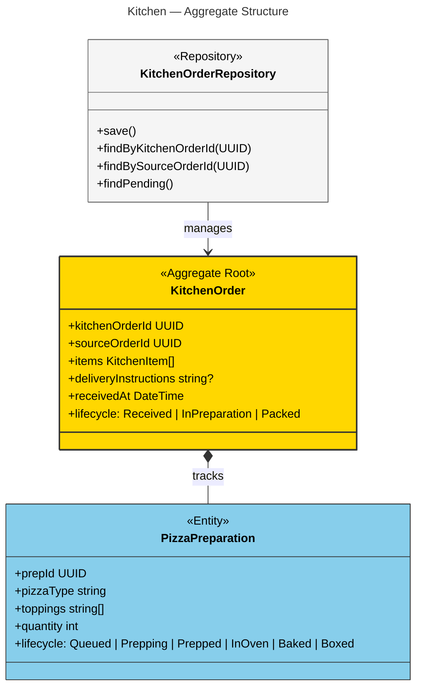

**Invariants and Design Notes:**

```
%% Invariants (KitchenOrder aggregate):
%% • Kitchen order must have at least one item
%% • All pizzas must be Boxed before order can be Packed
%% • Kitchen order cannot be Packed if any pizza is still in preparation

%% Kitchen Order Lifecycle States:
%% Received -> initial state when kitchen receives the order (evt-kitchen-notified)
%% InPreparation -> pizzas are being prepped/cooked (ongoing)
%% Packed -> all pizzas boxed and order packed for delivery

%% PizzaPreparation Lifecycle States (per individual pizza):
%% Queued -> initial state in the order
%% Prepping -> pizza chef begins prep work
%% Prepped -> dough, sauce, cheese, toppings placed; ready for oven
%% InOven -> pizza in brick oven
%% Baked -> pizza done baking
%% Boxed -> pizza placed in box for delivery

%% Ubiquitous Language (Kitchen):
%% - Prep: Pizza preparation before baking — dough, sauce, cheese, toppings
%%   Joe: "We prep the pizza to be cooked — that's the term that we use."
%% - Bake: Cooking prepped pizza in brick oven; part experience, part timer
%% - Box: Packaging individual baked pizza in box (per-pizza)
%% - Pack: Assembling all boxed pizzas with delivery instructions for handoff
%%   Joe: "order packed for delivery — which would include delivery instructions"
%% - Kitchen Order: Kitchen's view of customer order — items only, no customer/price

%% Design Notes:
%% - sourceOrderId is a UUID reference, not direct entity reference
%%   — respects BC boundary between Order Management and Kitchen
%% - deliveryInstructions included in KitchenOrder because "order packed for
%%   delivery — which would include the delivery instructions" (Joe)
%% - Kitchen has intentionally restricted view: "they don't care who it's for"
%%   Joe explicitly said kitchen doesn't need customer info or prices
%% - The detailed PizzaPreparation lifecycle reflects real kitchen operations
%%   and the brick oven cooking process described by Joe
```

---

## Command-Event Flow: Kitchen Bounded Context

The Kitchen context coordinates pizza preparation through commands issued by kitchen staff and policies triggered by order arrival. Pizzas move through the preparation pipeline, with each transition emitting an event. The pivotal Order Prepared & Packed event signals readiness for delivery.

```mermaid
---
title: Kitchen — Command-Event Flow
---
classDiagram
    %% COMMANDS
    class PrepPizza {
        <<Command>>
        +kitchenOrderId UUID
        +prepId UUID
    }

    class CookPizza {
        <<Command>>
        +kitchenOrderId UUID
        +prepId UUID
    }

    class PackOrder {
        <<Command>>
        +kitchenOrderId UUID
    }

    %% DOMAIN EVENTS
    class KitchenNotified {
        <<Domain Event>>
        +kitchenOrderId UUID
        +sourceOrderId UUID
        +items KitchenItem[]
        +receivedAt DateTime
    }

    class PizzaPrepStarted {
        <<Domain Event>>
        +kitchenOrderId UUID
        +prepId UUID
        +startedAt DateTime
    }

    class PizzaPrepFinished {
        <<Domain Event>>
        +kitchenOrderId UUID
        +prepId UUID
        +finishedAt DateTime
    }

    class PizzaPutInOven {
        <<Domain Event>>
        +kitchenOrderId UUID
        +prepId UUID
        +ovenedAt DateTime
    }

    class PizzaBaked {
        <<Domain Event>>
        +kitchenOrderId UUID
        +prepId UUID
        +bakedAt DateTime
    }

    class PizzaPulledOutOfOven {
        <<Domain Event>>
        +kitchenOrderId UUID
        +prepId UUID
        +pulledAt DateTime
    }

    class PizzaBoxed {
        <<Domain Event>>
        +kitchenOrderId UUID
        +prepId UUID
        +boxedAt DateTime
    }

    class OrderPreparedAndPacked {
        <<Domain Event>>
        +kitchenOrderId UUID
        +sourceOrderId UUID
        +deliveryInstructions string
        +packedAt DateTime
    }

    %% POLICIES
    class NotifyKitchenOnOrderPlaced {
        <<Policy>>
        +rule: "When OrderPlaced, create KitchenOrder and emit KitchenNotified"
    }

    %% APPLICATION SERVICE
    class ManageKitchenOrderService {
        <<Application Service>>
        +prepPizza()
        +cookPizza()
        +packOrder()
    }

    %% INCOMING EVENTS (from Order Management)
    class OrderPlaced {
        <<Domain Event>>
        ~~from Order Management~~
    }

    %% RELATIONSHIPS: EXTERNAL EVENT → POLICY
    OrderPlaced ..> NotifyKitchenOnOrderPlaced : triggers

    %% RELATIONSHIPS: POLICY → EVENTS
    NotifyKitchenOnOrderPlaced ..> KitchenNotified : issues

    %% RELATIONSHIPS: COMMANDS → EVENTS
    PrepPizza ..> PizzaPrepStarted : emits
    CookPizza ..> PizzaPutInOven : emits
    PackOrder ..> OrderPreparedAndPacked : emits

    %% RELATIONSHIPS: SERVICE → COMMANDS
    ManageKitchenOrderService ..> PrepPizza : handles
    ManageKitchenOrderService ..> CookPizza : handles
    ManageKitchenOrderService ..> PackOrder : handles

    %% APPLY STYLES
    cssClass "PrepPizza" command
    cssClass "CookPizza" command
    cssClass "PackOrder" command
    cssClass "KitchenNotified" domainEvent
    cssClass "PizzaPrepStarted" domainEvent
    cssClass "PizzaPrepFinished" domainEvent
    cssClass "PizzaPutInOven" domainEvent
    cssClass "PizzaBaked" domainEvent
    cssClass "PizzaPulledOutOfOven" domainEvent
    cssClass "PizzaBoxed" domainEvent
    cssClass "OrderPreparedAndPacked" domainEvent
    cssClass "NotifyKitchenOnOrderPlaced" policy
    cssClass "ManageKitchenOrderService" domainService
    cssClass "OrderPlaced" domainEvent

    classDef command fill:#FFA500,stroke:#333,stroke-width:1px,color:#000
    classDef domainEvent fill:#FFA07A,stroke:#333,stroke-width:1px,color:#000
    classDef policy fill:#DDA0DD,stroke:#333,stroke-width:1px,color:#000
    classDef domainService fill:#D3D3D3,stroke:#333,stroke-width:1px,color:#000
```

**Command Preconditions and Policy Logic:**

```
%% Command: Prep Pizza
%% Status: proposed
%% Preconditions:
%%   - PizzaPreparation must be in Queued state
%%   - KitchenOrder must be in Received or InPreparation state
%% Emits: PizzaPrepStarted
%% Initiated by: Pizza Chef (act-pizza-chef)
%% Maps to ESML cmd-prep-pizza (seq 7)
%% Joe: "We prep the pizza to be cooked — that's the term that we use."

%% Command: Cook Pizza
%% Status: proposed
%% Preconditions: PizzaPreparation must be in Prepped state
%% Emits: PizzaPutInOven
%% Initiated by: Pizza Chef (act-pizza-chef-oven)
%% Maps to ESML cmd-cook-pizza (seq 9)
%% Joe: "You have a big spatula thing and you put it in the pizza oven."

%% Command: Pack Order
%% Status: proposed
%% Preconditions: All PizzaPreparations must be in Baked or Boxed state
%% Emits: OrderPreparedAndPacked
%% Initiated by: Kitchen Staff (act-kitchen-staff)
%% Maps to ESML cmd-pack-order (seq 12)
%% Covers both boxing individual pizzas and packing complete order

%% Policy: Notify Kitchen on Order Placed
%% Status: draft (inferred from transcript and board flow)
%% Trigger: OrderPlaced event (from Order Management)
%% Rule: When OrderPlaced, create KitchenOrder and emit KitchenNotified
%% Joe: "once you order placed, that's an event that notifies"
%%       "this automatically triggers this"
%% No explicit policy sticky on ESML board — inferred from event sequence
%% The Kitchen context receives the pivotal OrderPlaced event from Order Management

%% Event: Order Prepared & Packed (PIVOTAL)
%% Status: proposed
%% This is the second pivotal event on the board
%% Marks transition from Kitchen to Delivery
%% Payload includes all info needed by Delivery (customer contact, address, instructions)
%% Joe: "order packed for delivery — which would include the delivery instructions"
%% Consumed by: bc-delivery

%% Note on Pizza Lifecycle Events:
%% The following events are emitted during the PizzaPreparation lifecycle
%% and do not have explicit commands:
%% - PizzaPrepFinished: outcome of prep process, no command
%% - PizzaBaked: time-based outcome, no command ("bake it")
%% - PizzaPulledOutOfOven: chef pulls pizza when ready, no command
%% - PizzaBoxed: part of packing flow, may be command or outcome
%%
%% These are modeled as implicit outcomes of kitchen work and could be
%% formalized as commands in a future iteration if needed.
```

---

## Aggregate Structure: Delivery Bounded Context

The Delivery context owns a single aggregate: Delivery. This represents the delivery-specific view combining customer contact information and order reference for the delivery driver. The driver picks up from the kitchen and delivers to the customer's address.

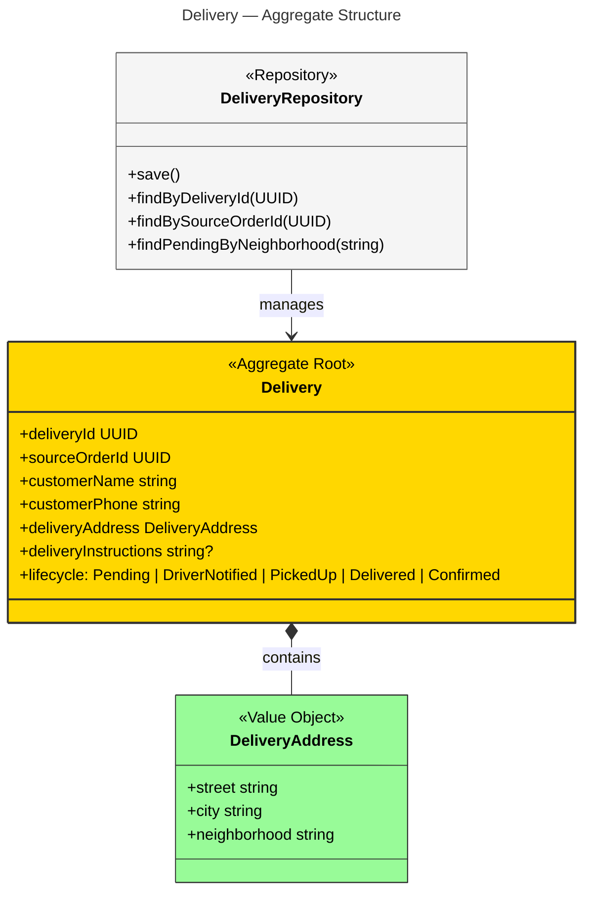

**Invariants and Design Notes:**

```
%% Invariants (Delivery aggregate):
%% • Delivery must have a delivery address
%% • Delivery must have a customer name
%% • Order can only be picked up after driver is notified
%% • Delivery confirmation requires prior physical delivery

%% Delivery Lifecycle States:
%% Pending -> initial state when created from packed order
%% DriverNotified -> driver has been notified of ready order (evt-delivery-people-notified)
%% PickedUp -> driver picked up order from kitchen (evt-order-picked-up)
%% Delivered -> physical delivery to customer completed (evt-order-delivered, PIVOTAL)
%% Confirmed -> delivery confirmed in system (evt-order-delivery-notified)

%% Ubiquitous Language (Delivery):
%% - Delivery: Act of transporting packed order from Joe's to customer's address
%%   Includes driver assignment, pickup, transit, and confirmation
%% - Delivery Person: Driver employed by Joe's, organized by neighborhood zones
%%   Picks up orders and delivers to customers
%% - Delivery Contact: Customer's contact info needed for delivery
%%   Name, phone, address, delivery instructions — delivery-specific view

%% Design Notes:
%% - Delivery aggregate merges ESML agg-customer-delivery and agg-order-delivery
%%   In Delivery context, customer contact and order reference serve single purpose
%% - sourceOrderId is UUID reference, respects BC boundary
%% - Neighborhood in DeliveryAddress is particularly important for driver assignment
%%   Joe organizes drivers by neighborhood zones in São Paulo
%% - DeliveryRepository includes findPendingByNeighborhood() for zone-based dispatch
%% - Customer data flows through Kitchen Order's delivery instructions
%%   but source comes from original Order in Order Management context

%% Integration Pattern:
%% - Delivery is created from evt-order-prepared-and-packed (Kitchen event)
%% - Policy pol-create-delivery-on-order-packed bridges Kitchen and Delivery
%%   (policy marked draft because not explicitly on ESML board)
```

---

## Command-Event Flow: Delivery Bounded Context

The Delivery context coordinates order delivery through commands issued by kitchen staff and delivery drivers, along with policies triggered by packed-order events. The pivotal Order Delivered event marks the successful completion of the delivery workflow.

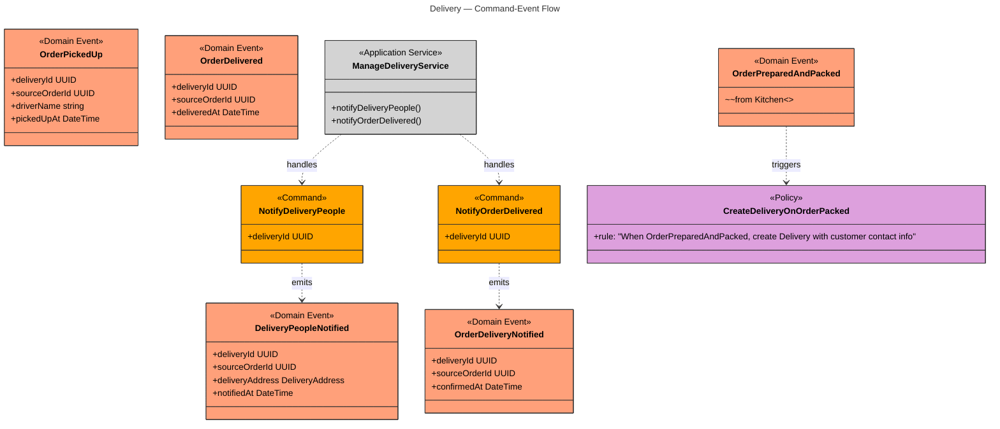

**Command Preconditions and Policy Logic:**

```
%% Command: Notify Delivery People
%% Status: proposed
%% Preconditions: Delivery must be in Pending state
%% Emits: DeliveryPeopleNotified
%% Initiated by: Kitchen Staff (act-kitchen-staff-delivery)
%% Maps to ESML cmd-notify-delivery-people (seq 14)
%% Crosses Kitchen/Delivery boundary — kitchen staff triggers delivery process
%% Joe discusses notification methods:
%%   - Drivers come to shop and see ready orders
%%   - "maybe we message our drivers, Pinheiros, hey, we got three orders for you, WhatsApp"

%% Command: Notify Order Delivered
%% Status: proposed
%% Preconditions: Delivery must be in PickedUp or Delivered state
%% Emits: OrderDeliveryNotified
%% Initiated by: Delivery Person (act-delivery-person-notify)
%% Maps to ESML cmd-notify-order-delivered (seq 17)
%% Joe: "I want them to tell me order delivered... so that way our system knows"

%% Policy: Create Delivery on Order Packed
%% Status: draft (inferred from flow; not explicit on ESML board)
%% Trigger: OrderPreparedAndPacked event (from Kitchen)
%% Rule: When order is prepared and packed, create Delivery record
%%       with customer contact info and delivery address from original order
%% This policy bridges Kitchen and Delivery contexts
%% Delivery context needs customer info that originates from Order Management,
%% flowing through Kitchen via packed order's delivery instructions

%% Note on Event: Order Picked Up
%% Status: proposed
%% No explicit command on ESML board — this is an outcome of driver action
%% Joe: "They'll pick up the order... they have to put your name with
%%       which orders you picked up" — implies tracking action
%% Could be formalized as command in future iteration

%% Event: Order Delivered (PIVOTAL)
%% Status: proposed
%% This is the third and final pivotal event on the board
%% Marks successful completion of delivery workflow
%% Joe: "at the bare minimum, after they picked it up,
%%       I want them to tell me order delivered"
%% This is the end of the order-to-delivery lifecycle
```

---

# Part 3 — Entity Lifecycles

## Order Lifecycle (Order Management Context)

An Order progresses through five states, starting from customer request through pizza selection (concurrent with delivery info), payment processing, and final placement. Placement is automatic on payment confirmation.

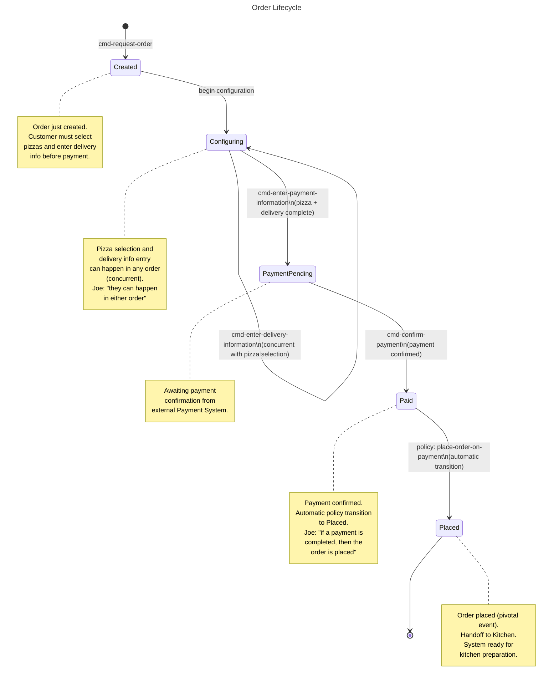

**Lifecycle Notes:**

```
%% Transitions marked as "inferred" come from domain knowledge in transcripts
%% rather than explicit events on ESML board:
%% - Configuring state reflects Joe's description of concurrent pizza+delivery
%% - Paid -> Placed is automatic policy (drafted because inferred)

%% Status values in Order entity map to these states:
%% Created, Configuring, PaymentPending, Paid, Placed

%% Invariant enforcement across lifecycle:
%% - Order must have >= 1 OrderItem (enforced in Configuring, PaymentPending, Paid, Placed)
%% - Customer info must be complete (enforced before PaymentPending)
%% - Payment must complete (enforced in Paid -> Placed)

%% Events emitted per state:
%% Created: evt-order-requested
%% Configuring: evt-type-of-pizzas-selected, evt-delivery-information-entered
%% PaymentPending: evt-payment-information-entered
%% Paid: evt-payment-completed
%% Placed: evt-order-placed (PIVOTAL)
```

---

## Kitchen Order Lifecycle (Kitchen Context)

A Kitchen Order progresses through three states as pizzas move through the preparation pipeline: from initial receipt, through active preparation, to final packing for delivery.

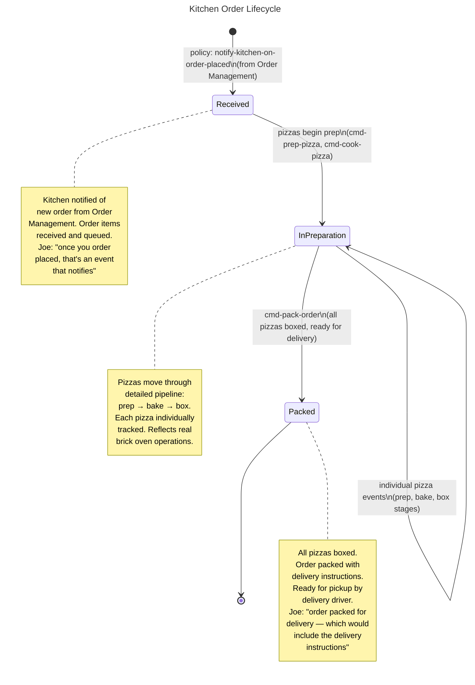

**Lifecycle Notes:**

```
%% KitchenOrder states:
%% Received: when kitchen is notified of OrderPlaced (inferred)
%% InPreparation: when first pizza prep begins
%% Packed: when all pizzas are boxed and order is ready for delivery

%% Individual PizzaPreparation states:
%% Queued -> Prepping -> Prepped -> InOven -> Baked -> Boxed
%% These substates are tracked by child entity PizzaPreparation

%% Invariant: All pizzas must reach Boxed state before KitchenOrder
%% can transition to Packed (enforced by precondition on cmd-pack-order)

%% Events emitted per state:
%% Received: evt-kitchen-notified (from policy triggered by evt-order-placed)
%% InPreparation: evt-pizza-prep-started, evt-pizza-prep-finished,
%%                evt-pizza-put-in-oven, evt-pizza-baked,
%%                evt-pizza-pulled-out-of-oven, evt-pizza-boxed
%% Packed: evt-order-prepared-and-packed (PIVOTAL)

%% Design note: The detailed lifecycle reflects Joe's brick oven process
%% and the sequential nature of pizza preparation: prep materials, shape dough,
%% apply sauce/cheese/toppings, oven bake, pull and box.
```

---

## Delivery Lifecycle (Delivery Context)

A Delivery progresses through five states from creation (on packed-order notification) through driver notification, pickup, physical delivery, and final system confirmation.

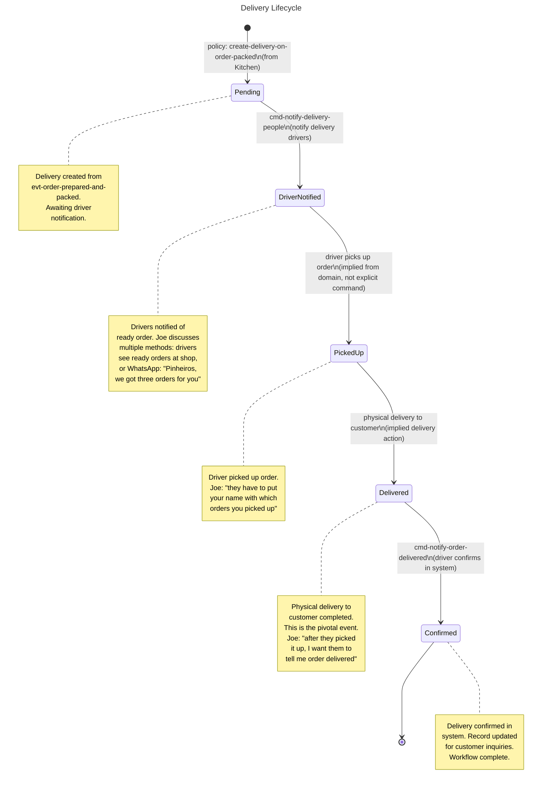

**Lifecycle Notes:**

```
%% Delivery states:
%% Pending: created by policy from evt-order-prepared-and-packed
%% DriverNotified: driver has been notified and accepted delivery
%% PickedUp: driver has picked up the order from kitchen
%% Delivered: physical delivery to customer completed (PIVOTAL)
%% Confirmed: delivery confirmed in system by driver

%% Transitions marked as "implied from domain":
%% - PickedUp: no explicit command, but outcome of driver action
%% - Delivered: no explicit command, but outcome of physical delivery
%%   These could be formalized as commands in a future iteration

%% Events emitted per state:
%% Pending: (no event on creation; driven by policy)
%% DriverNotified: evt-delivery-people-notified
%% PickedUp: evt-order-picked-up (inferred outcome)
%% Delivered: evt-order-delivered (PIVOTAL)
%% Confirmed: evt-order-delivery-notified

%% Invariants:
%% - Order can only be picked up after driver is notified
%% - Delivery confirmation requires prior physical delivery

%% Neighborhood assignment:
%% DeliveryAddress includes neighborhood for zone-based driver dispatch
%% Repository method findPendingByNeighborhood(string) supports this pattern
%% Joe organizes drivers by neighborhood zones in São Paulo

%% Joe's informal notification approach:
%% "maybe we message our drivers, Pinheiros, hey, we got three orders for you, WhatsApp"
%% This maps to the DriverNotified state and cmd-notify-delivery-people command
```

---

## Summary: Domain Model Coverage

This diagram package represents the complete Joe's Pizza domain model, covering:

**Strategic Elements (Context Map):**
- 4 subdomains (3 core/supporting, 1 external generic)
- 4 bounded contexts (3 implementable, 1 external)
- 3 customer-supplier relationships (event-based)
- 1 ACL relationship (API-based with payment provider)

**Tactical Elements (Aggregate Structure & Command-Event Flow):**
- 3 implementable aggregates (Order, KitchenOrder, Delivery)
- 4 root entities + 4 child entities + 3 value objects
- 10 commands across the three domains
- 13 domain events (3 of which are pivotal, marking phase boundaries)
- 3 policies (2 inferred, 1 explicit on board)
- 3 application services (orchestrating command/event flows)
- 3 repositories (managing aggregate persistence)

**Behavioral Elements (Lifecycles):**
- 3 entity lifecycle state diagrams
- Order: 5 states (Created → Configuring → PaymentPending → Paid → Placed)
- KitchenOrder: 3 states (Received → InPreparation → Packed)
- Delivery: 5 states (Pending → DriverNotified → PickedUp → Delivered → Confirmed)
- Plus detailed PizzaPreparation substates in kitchen pipeline

**Information Preservation:**
- All ubiquitous language terms encoded in context map and structural diagrams
- All command preconditions shown as notes
- All invariants shown as notes
- Element status (draft/proposed) preserved in comments
- Integration patterns (ACL, callbacks, event payloads) preserved in comments
- Domain knowledge from workshop transcripts preserved throughout

**Diagram Quality:**
- 10 total diagrams organized in two-part structure (strategic + tactical)
- No single class diagram exceeds 15 classes (well within readability limits)
- Color scheme consistently applied across all diagrams
- All Mermaid syntax validated for Mermaid 9.x compatibility
- No `:::` inline styles, no `namespace` blocks, dashed arrows use `..>` in class diagrams

---

## Design Rationale (from Transcripts)

**Online-Only Ordering (Core Domain):**
Joe emphasized that his pizza shop is online-only, making the ordering experience a key differentiator. The detailed flow (pizza selection, delivery info, multiple payment methods) reflects Joe's focus on customer convenience.

**Brick Oven Expertise (Core Domain):**
The Kitchen domain's detailed lifecycle (prep → bake → box → pack) reflects Joe's expertise with a classic brick oven. The transcript reveals deep domain knowledge: "We prep the pizza to be cooked — that's the term that we use." This is where Joe's competitive advantage lies.

**Restricted Kitchen View:**
Joe explicitly stated: "the kitchen mostly needs early on just the order" and "they don't care who it's for and we don't care where it goes — we just need to know what kind of order." This justified the KitchenOrder aggregate's minimal structure (items only, no customer info or price).

**Neighborhood-Based Delivery:**
Joe organizes his drivers by neighborhood zones in São Paulo (e.g., "Pinheiros"). The Delivery context's neighborhood field in DeliveryAddress supports this zone-based dispatch pattern.

**External Payment:**
Joe decided explicitly: "The payment system may have that, but we don't need it within our system — otherwise we have to deal with PCI compliance." This justified the Payment Gateway as external with an ACL, avoiding PCI compliance requirements.

**Informal Communication:**
Joe discussed informal driver notification: "maybe we message our drivers, Pinheiros, hey, we got three orders for you, WhatsApp." This maps to the cmd-notify-delivery-people command and reflects real-world operational practices.

---

*End of Diagram Package*
