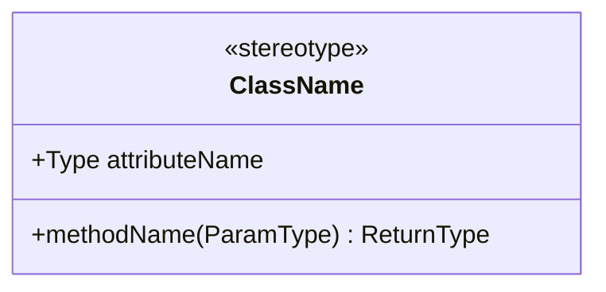
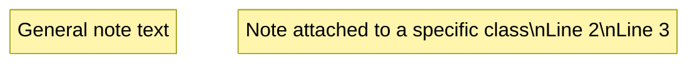
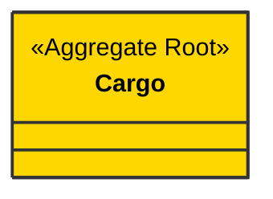
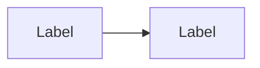
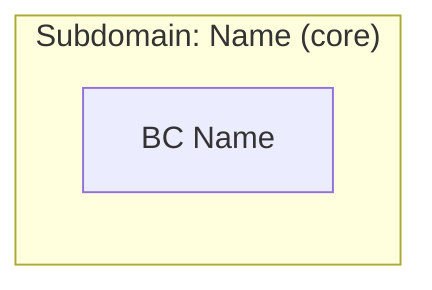
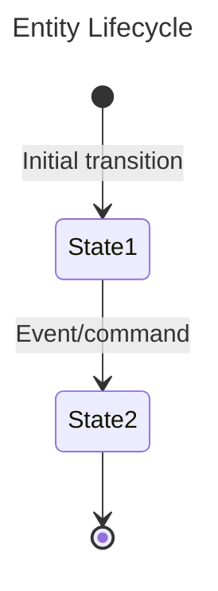
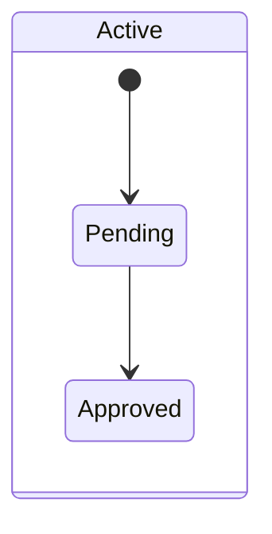
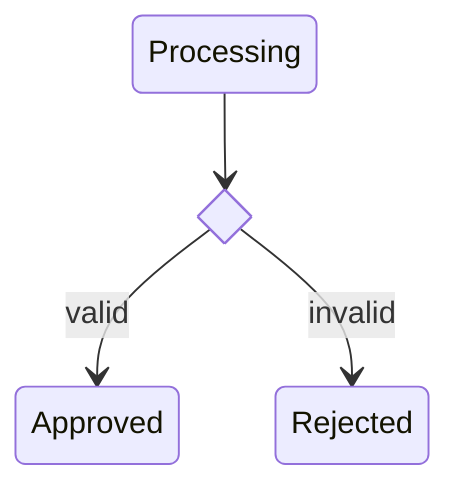
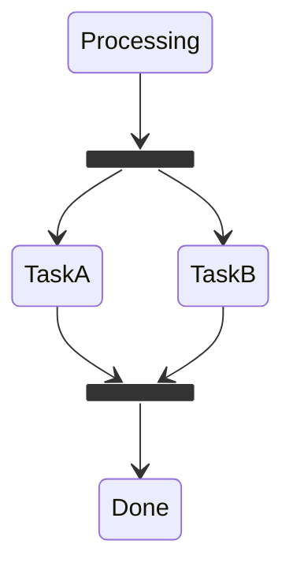

# Mermaid Capabilities Reference

Quick reference for the Mermaid diagram types and features used by this skill.
Consult this before generating diagrams to ensure correct syntax.

## Class Diagrams

### Basic Structure



### Visibility Modifiers
- `+` Public, `-` Private, `#` Protected, `~` Package/Internal

### Stereotypes (Annotations)
- Custom text between `<<` and `>>` — any string is valid
- Applied inside class body as first line, or via `<<stereotype>> ClassName`
- Common: `<<interface>>`, `<<abstract>>`, `<<enumeration>>`
- DDD-specific (custom, all valid): `<<Aggregate Root>>`, `<<Entity>>`,
  `<<Value Object>>`, `<<Command>>`, `<<Domain Event>>`, `<<Policy>>`,
  `<<Read Model>>`, `<<Domain Service>>`, `<<Application Service>>`,
  `<<Repository>>`, `<<Factory>>`, `<<Specification>>`

### Relationships

| Syntax | Meaning | Use For |
|---|---|---|
| `A *-- B` | Composition | Aggregate root → VOs, child entities |
| `A o-- B` | Aggregation | Weaker containment |
| `A --> B` | Association | Cross-aggregate references |
| `A ..> B` | Dependency (dashed) | Behavioral flow (emits, triggers) |
| `A <\|-- B` | Inheritance | Entity hierarchies |

**With labels:**
```
Cargo *-- RouteSpecification : contains
BookCargo ..> CargoBooked : emits
```

**With cardinality:**
```
Cargo "1" *-- "1..*" Leg : legs
```

### Notes



- Use `\n` for line breaks inside notes
- Keep notes concise (3-4 lines max for readability)
- Notes cannot be individually styled

### CSS Classes (Styling)

Define custom styles and apply them to classes:



**CRITICAL — use `cssClass "X" cssName` to apply styles, NOT `X:::cssName`
(inline) and NOT `class X cssName` (which declares a new class instead of
styling).** The `:::` syntax was introduced in Mermaid 10.x and causes parse
errors in 9.x. The `class X cssName` syntax is for flowcharts only — in class
diagrams it creates a new class named `XcssName`. The `cssClass` statement
works correctly in all versions and all diagram types.

### Diagram Title

```mermaid
---
title: My Diagram Title
---
classDiagram
    ...
```

### Namespaces — DO NOT USE

Mermaid class diagram namespaces are buggy in practice:

- Relationships defined INSIDE namespace blocks are **silently dropped**
- Nested namespaces cause **parse errors**
- Workaround: Use `%%` comments to indicate grouping, and keep all class
  definitions and relationships at the top level of the diagram

### Comments

```
%% This is a comment — not rendered but preserved in the source
```

## Flowcharts

### Basic Structure



- Directions: `TB` (top-bottom), `BT`, `LR` (left-right), `RL`

### Node Shapes

| Syntax | Shape |
|---|---|
| `A["text"]` | Rectangle |
| `A("text")` | Rounded rectangle |
| `A(["text"])` | Stadium/pill |
| `A{"text"}` | Diamond |
| `A[/"text"/]` | Parallelogram |

### Subgraphs



- Can be nested (unlike class diagram namespaces)
- Can be styled with CSS classes

### Edge Types

| Syntax | Style |
|---|---|
| `-->` | Solid arrow |
| `-.->` | Dotted arrow |
| `==>` | Thick arrow |
| `-- text -->` | Labeled solid |
| `-. text .->` | Labeled dotted |

### Styling


## State Diagrams

### Basic Structure



- `[*]` = start/end pseudo-state
- Use `stateDiagram-v2` (not `stateDiagram`) for newer syntax

### Composite States



### Choice Points



### Notes

```mermaid
stateDiagram-v2
    State1 : State One
    note right of State1 : This is a note
    note left of State2
        Multi-line note
        continues here
    end note
```

### Fork / Join (Concurrent)



## General Limits and Constraints

### Practical Size Limits
- **Characters per diagram:** 50,000 max (default)
- **Nodes per diagram:** ~50 for good readability; ~100 max before layout
  degrades significantly
- **Connections per diagram:** ~100 practical limit

### Rendering Notes
- Mermaid layout is computed client-side — very large diagrams cause
  browser slowdown
- Some renderers (GitHub) have stricter limits than the Mermaid CLI
- Always test large diagrams in the Mermaid Live Editor

### Feature Gaps
- No individual element coloring outside CSS classes (can't color one
  specific node differently without defining a class for it)
- No bidirectional labeled edges (must use two separate edges)
- No method signatures with full generics (workaround: use simplified types)
- No HTML in class diagram labels (works in flowcharts only)
- `<br>` for line breaks works inconsistently — prefer `\n` in notes

### Multiple Diagrams in One File
- Mermaid-aware Markdown renderers (GitHub, Obsidian, VS Code) process
  each fenced code block independently
- Each block can be a different diagram type
- This is the basis for our multi-diagram output strategy
